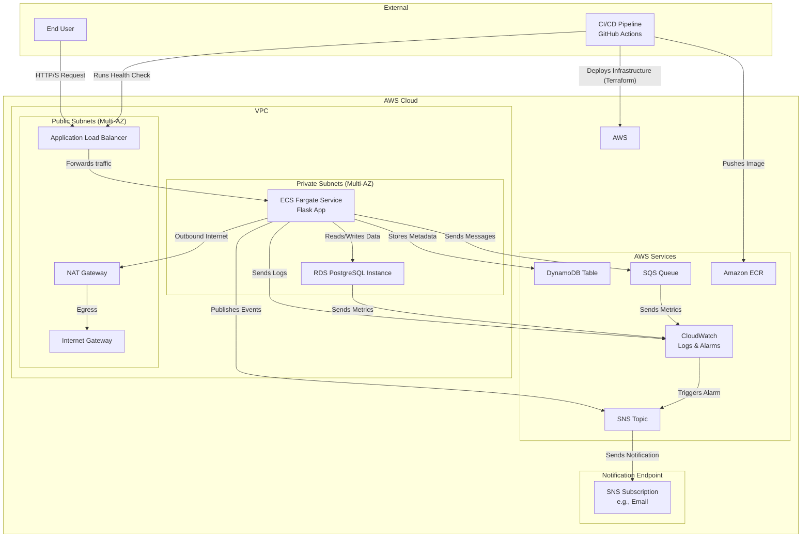

# Bonmoja AWS Messaging System Infrastructure

This repository contains a production-ready, AWS-based infrastructure for a containerized web application. It is provisioned entirely with Terraform and deployed automatically via a CI/CD pipeline using GitHub Actions.

This project demonstrates modern DevOps and cloud-native best practices, including immutable infrastructure, automated testing, and comprehensive monitoring. Instead of a simple echo container, this solution uses a custom Python Flask application to provide a more realistic and extensible workload.

## Table of Contents

- [Architecture Diagram](#architecture-diagram)
- [Key Features](#key-features)
- [Prerequisites](#prerequisites)
- [Deployment](#deployment)
- [Local Development Workflows](#local-development-workflows)
- [Repository Structure](#repository-structure)

## Architecture Diagram


## Key Features

- **Infrastructure as Code (IaC):** The entire AWS stack is defined declaratively using modular Terraform code.
- **CI/CD Automation:** A robust GitHub Actions pipeline automates builds, testing, and deployments on every push to `master`.
- **Immutable Infrastructure:** Docker images are tagged with commit SHAs, ensuring every deployment is a new, consistent, and traceable artifact.
- **Production-Ready Container:** A custom Flask application runs in a hardened, multi-stage Docker container as a non-root user.
- **Secure Networking:** A multi-AZ VPC with public and private subnets isolates sensitive resources like the database.
- **Observability:** CloudWatch is used for centralized logging and proactive monitoring with alarms on key metrics (RDS CPU, SQS Queue depth).
- **Comprehensive Documentation:** Includes this `README.md` for setup and a `SOLUTION.md` for deep-dives into architecture, security, and cost-saving strategies.

## Prerequisites

- **Terraform** (`v1.5.0` or newer)
- **AWS CLI** (`v2.0` or newer)
- **Docker** Engine
- A **GitHub Account** and a forked copy of this repository.
- An **AWS Account** with sufficient permissions to create the required resources.

## Deployment

### CI/CD Deployment (Recommended Workflow)

The primary and recommended method for deploying this infrastructure is to use the automated CI/CD pipeline. The pipeline is configured to run on every push to the `master` branch.

**To trigger a deployment:**
1.  Commit your changes to a feature branch.
2.  Create a Pull Request to merge into `master`.
3.  Once the Pull Request is reviewed and merged, the GitHub Actions workflow will automatically:
    - Build and push the new Docker image to ECR with a unique commit SHA tag.
    - Deploy the infrastructure changes via Terraform, updating the ECS service to use the new image.
    - Run the `scripts/health_check.py` script to validate the deployment is healthy.

This method ensures that every deployment is automated, version-controlled, and consistent.

## Local Development Workflows

This guide provides two distinct workflows for local development and testing.

### Workflow 1: Local Application Testing (without AWS)
This approach is fast and ideal for iterating on the application code. It allows you to build and test the container on your local machine without deploying any cloud resources.

**1. Prerequisites:**
- Docker installed and running.
- Python 3.9+ installed.

**2. Build and Run the Container:**
From the root of the project, build the image and run the container, mapping port 8080.
```bash
# Build the image
docker build -t bonmoja-flask-app .

# Run the container
docker run --rm -p 8080:8080 bonmoja-flask-app
```

**3. Test the Endpoints:**
In a new terminal, test the running application with `curl`.
```bash
# Test the health endpoint
curl http://localhost:8080/health

# Test the root endpoint
curl http://localhost:8080/
```

### Workflow 2: Full Infrastructure Deployment from Local
This approach deploys the full infrastructure stack to your AWS account from your local machine. This is useful for end-to-end testing or initial setup.

**1. Authenticate AWS CLI:**
Ensure your AWS CLI is configured with the necessary permissions.
```bash
aws configure
```

**2. Build and Push the Docker Image to ECR:**
The Terraform deployment requires the image to exist in ECR.
```bash
# Set your AWS Account ID and region
export AWS_ACCOUNT_ID=$(aws sts get-caller-identity --query Account --output text)
export AWS_REGION=$(aws configure get region)
export REPO_URI="${AWS_ACCOUNT_ID}.dkr.ecr.${AWS_REGION}.amazonaws.com/bonmoja-assessment-repo"
export IMAGE_TAG="local-test-$(date +%s)"

# Authenticate Docker to ECR
aws ecr get-login-password --region $AWS_REGION | docker login --username AWS --password-stdin $REPO_URI

# Build, tag, and push the image
docker build -t $REPO_URI:$IMAGE_TAG .
docker push $REPO_URI:$IMAGE_TAG
```

**3. Prepare Terraform Variables:**
Create a `terraform.tfvars` file and provide the required variables.
```hcl
# terraform.tfvars
project_name    = "bonmoja-assessment"
aws_region      = "us-east-1"
ecs_image_uri   = "YOUR_REPO_URI:YOUR_IMAGE_TAG" # e.g., from the step above
db_password     = "your-secure-database-password"
sns_email       = "your-email@example.com"
```

**4. Deploy with Terraform:**
```bash
terraform init
terraform apply -auto-approve
```

**5. Test and Destroy:**
After deployment, use the `alb_dns_name` output to test the service. When finished, clean up all resources.
```bash
# Test the live endpoint
export ALB_URL=$(terraform output -raw alb_dns_name)
python scripts/health_check.py http://$ALB_URL/

# Destroy the infrastructure
terraform destroy -auto-approve
```

## Repository Structure

```
.
├── .github/
│   └── workflows/
│       └── deploy.yaml         # Main CI/CD pipeline for deployment and health checks.
├── app/
│   ├── app.py                  # The Flask web application code.
│   └── requirements.txt        # Python dependencies for the Flask app.
├── modules/
│   ├── ecs/                    # Terraform module for all ECS, ALB, and related resources.
│   ├── rds/                    # Terraform module for the RDS PostgreSQL instance.
│   └── vpc/                    # Terraform module for the VPC, subnets, and networking.
├── scripts/
│   └── health_check.py         # Python script to validate the service is healthy post-deployment.
├── Dockerfile                  # Defines the multi-stage build for our production-ready Flask app.
├── .dockerignore               # Specifies files to exclude from the Docker build context.
├── main.tf                     # Root Terraform file to assemble all modules.
├── variables.tf                # Centralized Terraform variable definitions.
├── outputs.tf                  # Root-level Terraform outputs (e.g., ALB DNS name).
├── terraform.tfvars            # Terraform variable values (not committed if sensitive).
├── README.md                   # This file: Project overview, setup, and documentation.
└── SOLUTION.md                 # Detailed explanation of architecture, trade-offs, and design choices.
```
