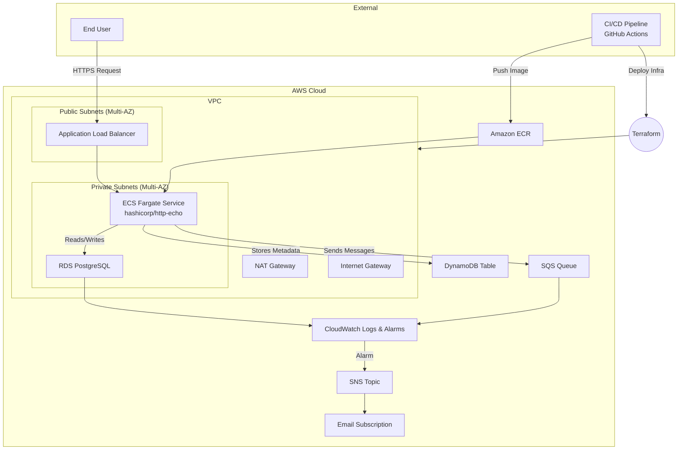

# Simple Messaging System on AWS

This repository contains the infrastructure-as-code and CI/CD pipeline for a simple messaging system deployed on AWS using Terraform, GitHub Actions, and ECS Fargate. The system includes an HTTP echo service, RDS PostgreSQL, DynamoDB, SQS, and SNS with monitoring and alerting.

## Table of Contents

- [Architecture Diagram](#architecture-diagram)
- [Requirements](#requirements)
- [Prerequisites](#prerequisites)
- [Setup Instructions](#setup-instructions)
- [Repository Structure](#repository-structure)
- [Health Check Script](#health-check-script)
- [CI/CD Pipeline](#ci-cd-pipeline)
- [Cost Optimization](#cost-optimization)

## Architecture Diagram



## Requirements

- Terraform v1.0+
- AWS CLI configured with credentials
- GitHub account with repository access

## Prerequisites

1. Install Terraform: https://www.terraform.io/downloads.html
2. Configure AWS CLI:
   ```bash
   aws configure
   ```

## Setup Instructions

1. **Clone the Repository**
   ```bash
   git clone git@github.com:your-org/simple-messaging-aws.git
   cd simple-messaging-aws
   ```

2. **Initialize Terraform**
   ```bash
   cd terraform
   terraform init
   ```

3. **Plan & Apply**
   ```bash
   terraform plan -out=tfplan
   terraform apply tfplan
   ```

4. **Verify Resources**
   - Check ECS service status in AWS Console
   - Confirm RDS endpoint is in private subnets
   - Verify DynamoDB table, SQS queue, and SNS topic exist

5. **Trigger CI/CD**
   - Push a commit with a version bump to rebuild and deploy via GitHub Actions.

## Repository Structure

```
├── terraform/
│   ├── main.tf
│   ├── variables.tf
│   ├── outputs.tf
│   └── modules/
├── .github/
│   └── workflows/
│       └── ci-cd.yml
├── scripts/
│   └── health_check.sh
├── README.md
└── SOLUTION.md
```

## Health Check Script

The `scripts/health_check.sh` script sends an HTTP request to the ECS service endpoint and logs the result:

```bash
#!/usr/bin/env bash
SERVICE_URL="$1"
RESPONSE=$(curl -s -o /dev/null -w "%{http_code}" "$SERVICE_URL")
if [ "$RESPONSE" -ne 200 ]; then
  echo "[WARNING] Service returned status $RESPONSE"
  exit 1
else
  echo "[OK] Service is healthy"
fi
```

## CI/CD Pipeline

GitHub Actions workflow (`.github/workflows/ci-cd.yml`):

1. Checkout code
2. Validate Terraform (`terraform fmt`, `terraform validate`)
3. Build & push Docker image to ECR
4. Apply Terraform changes
5. Run health check script

## Cost Optimization

- **Spot Fargate Tasks**: Use Fargate Spot to reduce container compute costs (up to 70% savings) at the expense of possible interruptions.
- **RDS Reserved Instances**: Purchase 1-year Reserved Instances for PostgreSQL to lower hourly rates in exchange for an upfront commitment.
